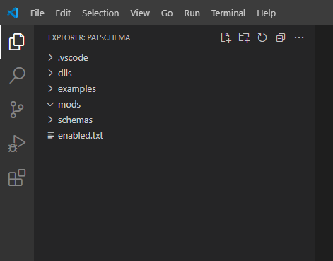
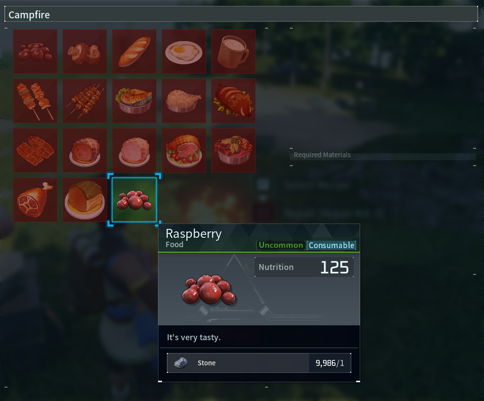

# Getting Started

## Essentials

* [Visual Studio Code](https://code.visualstudio.com/) - I heavily recommend getting this as it will make your life a lot easier when creating mods for PalSchema and I will explain in a bit why that is. Also don't mistake Visual Studio Code for Visual Studio which is an IDE rather than just a rich text editor. Visual Studio Code is very lightweight and is essentially just a better Notepad.

NOTE: Make sure to check `Add "Open with Code"` for both checkboxes as seen in the image below.


* [UE4SS Palworld](https://github.com/Okaetsu/RE-UE4SS/releases/tag/experimental-palworld) - You'll want to get the linked version rather than the latest one because Palworld did some engine modifications which now requires a `MemberVariableLayout.ini` with UE4SS. If you don't get the linked version you will experience crashes with certain mods and PalSchema is one of them. See issue [here](https://github.com/UE4SS-RE/RE-UE4SS/issues/802). UE4SS is required as PalSchema relies on it.

* [FModel](https://fmodel.app/) - Very useful for exploring Palworld files in general, you'll want this for referencing different data tables and assets in the game. Setup guide for FModel can be found [here](https://pwmodding.wiki/docs/asset-swapping/StartingOut). You only need to do what's on the linked `Starting Out` page. You can skip the 2D, 3D asset related stuff.

* [PalSchema](https://github.com/Okaetsu/PalSchema/releases) - You'll obviously need PalSchema itself. Make sure you get the PalSchema_x.x.x_Dev-beta version where x.x.x is the latest version available.

Installation guide for PalSchema can be found in [here](./installation.mdx).

## Setting Up

Now that you've got everything installed, head over to the Mods folder where you installed PalSchema and right click on the PalSchema folder.

You should see an `Open with Code` option as seen in the image below.


VSCode (Visual Studio Code) will now be open in a new window and you should see the following on the top-left side if everything was installed and setup correctly:



## Explanation of Different Folders

You'll notice there's a dlls, examples, mods and schemas folder.

* dlls - This is where the main file for PalSchema resides and is the one handling loading of PalSchema mods, leave it be.

* examples - I've included an example mod inside this folder that you can just drag into the mods folder and experiment with.

* mods - This is where you'll want to put your mod files.

* schemas - This is where VSCode will come in handy as it can read from the schema files inside to make sure our .json files are properly structured. Do not touch the files inside this folder.

If we take a look inside the examples folder, we'll see the following folders inside ExampleMod:

* appearance - This is where character creation related mods go like hair styles, eyes, head types, colors, etc...

* items - This is where item related mods go.

* pals - Pal related mods go here.

* raw - This is for table mods that aren't categorized so you can modify any tables here, will explain at the end of the list.

* skins - Pal skins and any other future skin types like buildings, weapons, etc.

* translations - This is where translations for anything in the game goes and you can specify which language the translation is for by naming the folder after any of the localizations listed in the L10N folder of Palworld or you can also do custom localization. Palworld natively supports de, en, es, fr, it, ko, pt-BR, ru, zh-Hans, zh-Hant and you can easily add support for other unsupported languages with custom localization mods.

Any mod that isn't a raw data table mod has some convenience logic behind them to make it so that you can edit multiple data tables without having to reference those other tables. You also get some neat autocompletion, detailed descriptions of each field and error checking.

## Creating a Mod

Now that we have all of that covered, let's get started. We'll start by creating an entirely new item based on an existing item in the game.

1. You'll want to right-click on the mods folder in VSCode, select `New Folder...` and name it `MyFirstMod`. You can also create the folders and files outside VSCode if it's easier.

2. Inside MyFirstMod create an `items` folder.

3. Now create a `my_item.json` file inside `items` folder. You can call it anything as long as it ends with .json


4. Next, we'll define our item inside `my_item.json`. write the following or copy-paste:

```json
{
    "MOD_Raspberry": {
        "Name": "Raspberry",
        "Description": "It's very tasty.",
        "Type": "Consumable",
        "IconTexture": "/Game/Others/InventoryItemIcon/Texture/T_itemicon_Food_Berries.T_itemicon_Food_Berries",
        "TypeA": "Food",
        "TypeB": "FoodDishVegetable",
        "Rank": 1,
        "Rarity": 1,
        "Price": 9999,
        "MaxStackCount": 9999,
        "Weight": 0.2,
        "VisualBlueprintClassSoft": "/Game/Pal/Blueprint/Item/VisualModel/BP_Item_BerryRed.BP_Item_BerryRed_C",
        "RestoreSatiety": 125,
        "RestoreHP": 25,
        "CorruptionFactor": 1.0,
        "Recipe": {
            "Product_Count": 1,
            "WorkAmount": 10.0,
            "Material1_Count": 1,
            "Material1_Id": "Stone"
        }
    }
}
```

I'll explain the above structure:

- `MOD_Raspberry` will be the internal code for our item that the game will use to identify which item we're referring to. You can make this anything, but you might be wondering why the MOD_ prefix? This is not required, but is good practice to avoid potential conflicts with future game updates as we can never know if they add an official item with the code `Raspberry` into the game. Do note that if this is set to an existing item id, it will modify that item instead rather than adding a new one. This can be particularly useful if you want to adjust the weight of existing items for example or anything else.

- Name is a field provided by PalSchema and provides a global translation for all languages. For specifying a localized name for a specific language, look into creating a translations language mod.

- Description is a field provided by PalSchema and provides a global translation for all languages. For specifying a localized description for a specific language, look into creating a translations language mod.

- Type is self explanatory and determines the logic for this item. Valid values are Weapon, Armor, Consumable and Generic with Generic having no special logic. Generic items are typically things like Materials (Stone, Wood, etc).

- TypeA and TypeB are used for determining what station the item can be crafted at.

- Rank is the tier of the station that's required to craft it. 1 being all of them.

- Rarity defines the icon background color and text color for the item.
  - 0 = Common
  - 1 = Uncommon
  - 2 = Rare
  - 3 = Epic
  - 4 = Legendary

- Price requires some manual calculation as it doesn't reflect the final value. You can get the final price by dividing the price by 10, so in our case 9999 / 10 = 999 gold in-game.

- MaxStackCount is self explanatory. Just don't go over 9999 due to duplication issue present in the Vanilla game.

- RestoreSatiety controls the amount of hunger replenished.

- RestoreHP is most likely health recovery gained from eating the item?

- CorruptionFactor controls how quickly the food spoils. 1.0 is default, lower values make the item spoil slower while higher values make it spoil faster. Fun fact: You can use this for any item, not just consumables.

- Recipe is something that doesn't normally exist within the table row and is something provided by PalSchema for convenience. This field automatically adds to the item recipe table. Product_Count is how many items are produced, WorkAmount is how long it should take to craft, Material_Count and Material_Id are the required materials and their count. Can go from 1 to 4. We've set the Raspberry to be craftable at any cooking station for 1 Stone.

Any fields not covered, you can just hover over it and you'll get a detailed description of what it is for. VisualBlueprintClassSoft as an example:


Here's an example of suggestions as well:


5. Done, That's everything! If you're used to having to package the mod into a .pak file, that step is completely removed with PalSchema as it loads the .json file directly when you launch the game. Let's test the mod in-game!



Success! We've created our first new item in Palworld! Now keep in mind that if you have any modded items in your world and you remove the mod, your world will not be playable anymore until you add the mod back in and remove those items.
