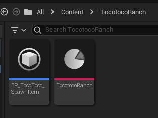
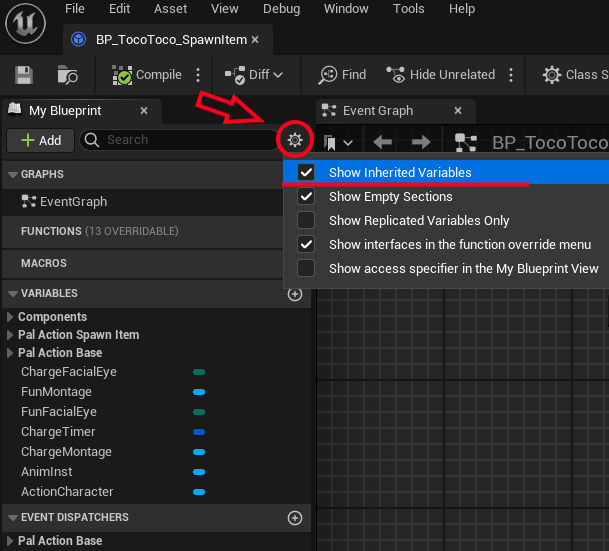
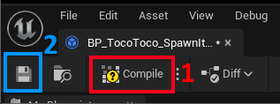
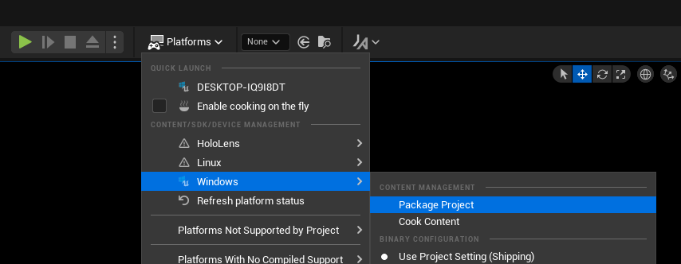

# Adding Ranch Suitability

So you've been wondering if you could make Tocotoco generate Gunpowder at the Ranch? Well, wonder no longer as we are finally able to do just that!

A disclaimer regarding the requirements for this guide as you'll be needing the Palworld Modding Kit and some dummy assets which will be provided during this guide.

## Requirements

- [Palworld Modding Kit](https://pwmodding.wiki/docs/palworld-modding-kit/install-part-1)
- [Assets](https://drive.google.com/file/d/1eghfagtz3WvyB7i4PXGWSt01qfQLzfOc/view?usp=sharing) - Contains empty animation montages for each Pal and a dummy asset for `BP_Action_SpawnItemBase` which will be used as a base for your preferred Pal's item spawning action blueprint.

## Palworld Modding Kit

Let's get started with PMK (Palworld Modding Kit). After you're done installing or if you already had it installed, start PMK.

### Creating the Assets and Folders

1. You'll be greeted with the Editor looking somewhat like this. If you have the `Assets` downloaded from the requirements, navigate to the .zip you downloaded and extract the Content folder from within the .zip into the root of your PMK. It might ask you to replace the folder itself, just click yes. If you already have certain assets like the animations, you can skip replacing those.


2. After you're done extracting the files to your project, you should now have a `Pal` folder visible in your editor. Create a new folder in the Content Browser by right-clicking and call this folder `TocotocoRanch`. You can call this folder anything, but just to make it easier to follow the tutorial, we'll call it that.


3. Navigate inside `TocotocoRanch` folder and create a new `Blueprint Class` by right-clicking. A window will pop-up, asking you to pick a Parent Class. You'll want to search for `BP_Action_SpawnItemBase`, click on it and then click the blue Select button. We'll name the newly created Blueprint Class to `BP_TocoToco_SpawnItem`, again, you have full freedom for naming as long as it's something you can remember.

4. We'll want to create one more Asset inside this folder. Right-click, hover over Miscellaneous and select Data Asset. Clicking on Data Asset will open up a menu asking you to Pick Class for Data Asset Instance. Look for `PrimaryAssetLabel` and select that, then name the created PrimaryAssetLabel to `TocotocoRanch`. Here's what we have so far.



5. Open up the `TocotocoRanch` PrimaryAssetLabel we created and change the following values:

- **Chunk ID**: 1 - This should be whatever Chunk ID you happen to have available, make sure you don't use a Chunk ID you've already assigned because it'll bundle other mods with your current mod, unless that's what you want. Never use a Chunk ID of 0.

- **Cook Rule**: Always Cook

- **Label Assets in My Directory**: Checked - This makes sure that whatever assets you have within your `TocotocoRanch` folder, gets recursively added to the packaging list of your mod.

Once you're done, click the Save icon to save your asset and close the PrimaryAssetLabel window.

### Assigning a Spawning Action

We're almost done here, we just need to make sure we create a spawn action for our Tocotoco, which we will be referencing later during the PalSchema section.

1. Open `BP_TocoToco_SpawnItem` and make sure you have `Show Inherited Variables` checked in the Settings. I'll include a picture below for guidance.



2. We want to change the `ChargeFacialEye`, `ChargeMontage`, `FunFacialEye`, `FunMontage` and `Spawn Socket Name` which is under the Pal Action Spawn Item category to the following values:

- **ChargeFacialEye**: Pain - This is the facial expression made by the Pal when it's preparing to spawn an item.

- **ChargeMontage**: AM_ColofulBird_FarSkill_ActionLoop - This is the animation loop that the Pal will be performing as it is preparing to spawn an item.

- **FunFacialEye**: Smile - This is the facial expression made by the Pal once it finishes spawning an item.

- **FunMontage**: AM_ColofulBird_Damage - This is the animation performed by the Pal once it finishes spawning an item.

- **Spawn Socket Name**: tail_02 - This is the name of the bone socket where the item will spawn at. There is no guarantee that every Pal has a `tail_02` bone so you'll want to use something like FModel to inspect the skeleton of the Pal and look up its list of bones e.g. if you wanted to check the bones for Nitewing, you'd look for the `SK_HawkBird_Skeleton` asset, open it and then search for `ReferenceSkeleton` and now you have a list of different bones.

3. We're done here, now just hit Compile (1), Save (2) and then close the asset Window.



### Packaging

We're ready to package our assets for use with our PalSchema mod.

1. In the top-middle, you should see a button that says Platforms, click on it and navigate to Windows > Package Project. The file explorer should be pointing to the root of your PalworldModdingKit by default. Click Select Folder and now we just wait for the packaging to be done.



2. Once packaging is done, navigate to the root of your PalworldModdingKit outside your Editor and you should see a `Windows` folder. Navigate to Windows > Pal > Content > Paks and you should see a `pakchunk1-Windows.pak` assuming you set your Chunk ID to 1. If you set your Chunk ID to 15 for example, then it'll be named `pakchunk15-Windows.pak`, so on and so forth. Remember this location as we will come back to it at the end of this guide.

## PalSchema

Now we just need to add the relevant data table entries for our Tocotoco to be able to work at the Ranch.

### Folder Structure

1. In your `PalSchema/mods` folder, create a new folder called `TocotocoRanch` which will be the name of our mod. Then inside it create the following folders:

- **blueprints**
- **paks**
- **raw**

You **MUST** name the three folders this way, otherwise PalSchema won't pick these up. The only cases where it doesn't matter is the name of your mod folder and any .json files you create.

### Raw Tables

1. Navigate to the `raw` folder and create a new file in there called `lottery.json` and make sure it is a json file.

2. `DT_ItemLotteryDataTable` is the table where the drops for Ranch pals are stored, so we'll want to add our entries to that table like so:

```json
{
    "DT_ItemLotteryDataTable": {
        "TocotocoRanch_001": {
            "FieldName": "CharacterSpawnItem_Tocotoco_1",
            "SlotNo": 1,
            "WeightInSlot": 1.0,
            "StaticItemId": "Gunpowder2",
            "MinNum": 1,
            "MaxNum": 1,
            "NumUnit": 1,
            "TreasureBoxGrade": "EPalMapObjectTreasureGradeType::Grade1"
        },
        "TocotocoRanch_002": {
            "FieldName": "CharacterSpawnItem_Tocotoco_2",
            "SlotNo": 1,
            "WeightInSlot": 1.0,
            "StaticItemId": "Gunpowder2",
            "MinNum": 1,
            "MaxNum": 2,
            "NumUnit": 1,
            "TreasureBoxGrade": "EPalMapObjectTreasureGradeType::Grade1"
        },
        "TocotocoRanch_003": {
            "FieldName": "CharacterSpawnItem_Tocotoco_3",
            "SlotNo": 1,
            "WeightInSlot": 1.0,
            "StaticItemId": "Gunpowder2",
            "MinNum": 1,
            "MaxNum": 3,
            "NumUnit": 1,
            "TreasureBoxGrade": "EPalMapObjectTreasureGradeType::Grade1"
        },
        "TocotocoRanch_004": {
            "FieldName": "CharacterSpawnItem_Tocotoco_4",
            "SlotNo": 1,
            "WeightInSlot": 1.0,
            "StaticItemId": "Gunpowder2",
            "MinNum": 1,
            "MaxNum": 4,
            "NumUnit": 1,
            "TreasureBoxGrade": "EPalMapObjectTreasureGradeType::Grade1"
        },
        "TocotocoRanch_005": {
            "FieldName": "CharacterSpawnItem_Tocotoco_5",
            "SlotNo": 1,
            "WeightInSlot": 1.0,
            "StaticItemId": "Gunpowder2",
            "MinNum": 1,
            "MaxNum": 5,
            "NumUnit": 1,
            "TreasureBoxGrade": "EPalMapObjectTreasureGradeType::Grade1"
        }
    }
}
```

You might notice that in the original table, all the row names are numbers. Absolutely do NOT use numbers yourself because you risk causing side effects like overwriting vanilla drops which is not relevant for when you want to add Ranch suitability to a new Pal. `FieldName` is something you should try to remember as we'll be referencing it in a couple files.

3. Create a new file called `lottery_probability.json` inside the `raw` folder and copy the following inside the .json file:

```json
{
    "DT_FieldLotteryNameDataTable": {
        "CharacterSpawnItem_Tocotoco_1": {
            "ItemSlot1_ProbabilityPercent": 100.0
        },
        "CharacterSpawnItem_Tocotoco_2": {
            "ItemSlot1_ProbabilityPercent": 100.0
        },
        "CharacterSpawnItem_Tocotoco_3": {
            "ItemSlot1_ProbabilityPercent": 100.0
        },
        "CharacterSpawnItem_Tocotoco_4": {
            "ItemSlot1_ProbabilityPercent": 100.0
        },
        "CharacterSpawnItem_Tocotoco_5": {
            "ItemSlot1_ProbabilityPercent": 100.0
        }
    }
}
```

We'll be referencing the `FieldName` from our previous .json file. We'll make `ItemSlot1_ProbabilityPercent` 100% in this guide, but you're free to make it 50.0 or whatever you want. We assigned `SlotNo` to be 1 in the `lottery.json` for all fields so that's why we're using `ItemSlot1_ProbabilityPercent` here.

4. Let's create our final raw table file and call it `monster_parameter.json` with the following in it:

```json
{
    "DT_PalMonsterParameter": {
        "ColorfulBird": {
            "WorkSuitability_MonsterFarm": 1
        }
    }
}
```

We'll need to make sure our Tocotoco has the MonsterFarm suitability which corresponds to Ranch. We'll be setting it to 1, because otherwise our Tocotoco will never go to the Ranch. `ColorfulBird` is the code name for Tocotoco and you can find a list of IDs on [Paldeck site](https://paldeck.cc/pals). Just click the little copy icon in the top-right corner of a Pal card.

### Blueprint

Next, we want to navigate to our `blueprints` folder we created earlier and create a `bp_tocotoco.json` file in which we will copy the following:

```json
{
    "/Game/Pal/Blueprint/Character/Monster/PalActorBP/ColorfulBird/BP_ColorfulBird.BP_ColorfulBird_C": {
        "ActionComponent": {
            "ActionMap": [
                {
                    "Key": "EPalActionType::SpawnItem",
                    "Value": "/Game/TocotocoRanch/BP_TocoToco_SpawnItem.BP_TocoToco_SpawnItem_C"
                }
            ]
        },
        "StaticCharacterParameterComponent": {
            "SpawnItem": {
                "FieldLotteryNameByRank": [
                  {
                    "Key": 1,
                    "Value": {
                      "Key": "CharacterSpawnItem_Tocotoco_1"
                    }
                  },
                  {
                    "Key": 2,
                    "Value": {
                      "Key": "CharacterSpawnItem_Tocotoco_2"
                    }
                  },
                  {
                    "Key": 3,
                    "Value": {
                      "Key": "CharacterSpawnItem_Tocotoco_3"
                    }
                  },
                  {
                    "Key": 4,
                    "Value": {
                      "Key": "CharacterSpawnItem_Tocotoco_4"
                    }
                  },
                  {
                    "Key": 5,
                    "Value": {
                      "Key": "CharacterSpawnItem_Tocotoco_5"
                    }
                  }
                ]
            }
        }
    }
}
```

I'll explain everything that's going on in this .json file.

So you might be wondering why we're using the full path for our blueprint instead of just the asset name like `BP_ColorfulBird_C`. We're using `/Game/Pal/Blueprint/Character/Monster/PalActorBP/ColorfulBird/BP_ColorfulBird.BP_ColorfulBird_C` because it makes sure the asset is loaded before we go in-game as there is a bug in PalSchema currently where assigning class values while in-game will crash the game. The class value in question is ActionComponent > ActionMap > Value which is a Class Property. If you're not assigning to a Class Property then there is no need to worry about it and you can just use the asset name as normal.

Now let's go through each property:

- **ActionComponent** - This is a component within the `BP_ColorfulBird_C` blueprint. It's responsible for any actions (animations) performed by the Pal like spawning items at the Ranch, using skills, etc.
  - **ActionMap** - Part of `ActionComponent` and contains a map of enum/class pairs which controls what asset is responsible for each action. In our case we want it to point to our `BP_TocoToco_SpawnItem_C` that we created in PMK. If you're unsure how to get the path to our asset, you can right-click on `BP_TocoToco_SpawnItem_C` in PMK and select `Copy Reference` which will copy the following string into your clipboard: `/Script/Engine.Blueprint'/Game/TocotocoRanch/BP_TocoToco_SpawnItem.BP_TocoToco_SpawnItem'`. You'll want to trim this down to `/Game/TocotocoRanch/BP_TocoToco_SpawnItem.BP_TocoToco_SpawnItem` and now you have your path, just make sure to add a `_C` to the end, since the property expects a class.

- **StaticCharacterParameterComponent** - This is another component within `BP_ColorfulBird_C` which has a LOT of functionality in it.
  - **SpawnItem** - Struct within `StaticCharacterParameterComponent` which contains the `FieldLotteryNameByRank` property.
    - **FieldLotteryNameByRank** - A TMap of integer/FName pairs where the integer corresponds to the Star Level of the Pal, with 1 being Star Level 0 and the FName string is a reference to a `FieldName` entry inside the `DT_ItemLotteryDataTable` table.

### Paks

1. Now if you remember in the [packaging](#packaging) section, we packaged our project and it produced `pakchunk-Windows.pak` files. Find the pakchunk file that corresponds to the Chunk ID you assigned to your `TocotocoRanch` mod, which in this guide we assigned a Chunk ID of 1, so we'd look for `pakchunk1-Windows.pak`. Copy or move this file into the `paks` folder within your PalSchema mod folder that you created earlier.

2. After you've moved or copied the file, rename it to `TocotocoRanch_P.pak` and make sure the name ends with a `_P` regardless of what you decide to call the .pak file as the game won't read the .pak file otherwise. You can read up more on patch paks over [here](https://buckminsterfullerene02.github.io/dev-guide/Basis/PakPatching.html) if you're interested.

## Finished Project

If we did everything correctly, Tocotoco should now have the ability to work at the Ranch!

